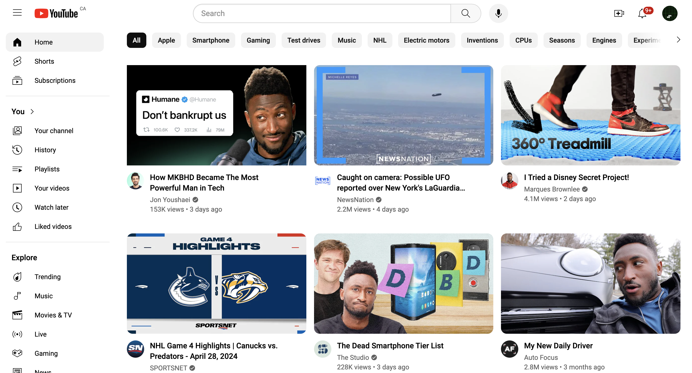
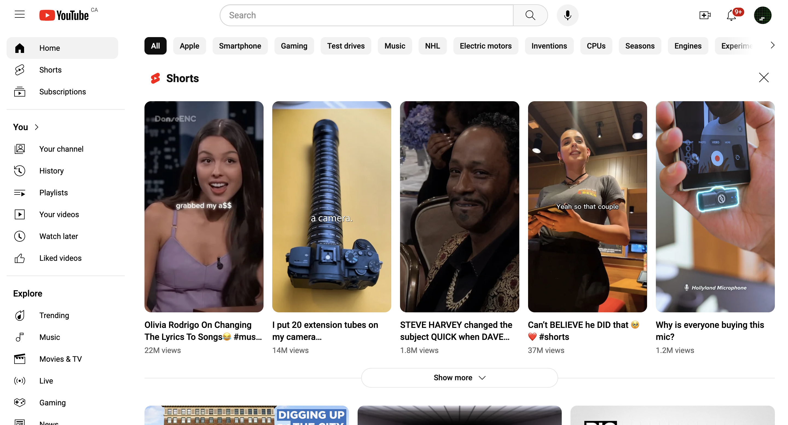

# YouTube.com Clone Project for HTML/CSS Practices

The objective of this project is to create a YouTube.com clone (front-end). As it for now, the main focus is on HTML/CSS side, JavaScript related feature may be integrated at a later time.

All media contents (thumbnails, profile pictures, etc.) are downloaded from YouTube.

## TODO

- trending section
- ads section
- handle window resizing

## Extensions

- show more button (JavaScript)
- clear button on search bar (JavaScript)
- option button on video info card and the pop-up widget (JavaScript)
- video page (HTML/CSS, JavaScript)
