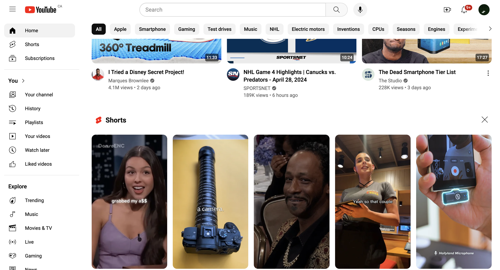
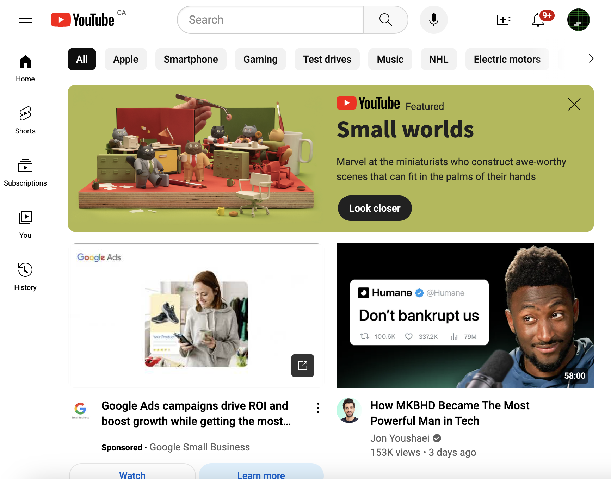

# YouTube.com Clone Project for HTML/CSS Practices

The objective of this project is to create a YouTube.com clone (front-end). As it for now, the main focus is on HTML/CSS side, JavaScript related feature may be integrated at a later time.

I tried my best to immitate the UI of the actual YouTube site to minor details and pixel perfect (window resizing behaviors, hover behaviors, colors, search bar behaviors, etc.). However, as I don't have a bigger screen, I developed this clone using my relatively small laptop screen, and I only tested it up to a 5-column content view. But anyway, please feel free to download and play around.

All media contents (thumbnails, profile pictures, etc.) are downloaded from YouTube.

p.s.
There are some impossible combinations UI elements (i.e. the two elements couldn't appear at the same time in the same state; an example would be, if you have premium, you wouldn't see ads), did you pick them up?

## Some Screenshots of This YouTube.com Clone

## Extensions

- show more button (JavaScript)
- clear button on search bar (JavaScript)
- filter bar scroll button (JavaScript)
- option button on video info card and the pop-up widget (JavaScript)
- video page (HTML/CSS, JavaScript)
